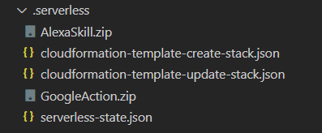

# Sample Serverless Bundle

This is a sample of a serverless project structure where the lambda function and node_modules are already zipped into `bundle.zip`.

The `serverless.yml` file has CloudFormation settings for IAM, Lambda, DynamoDB, and API Gateway. There are 2 functions to deploy separately (AlexaSkill and GoogleAction) that use the same source code.

An outside process already bundles the Node source code into `bundle.zip`.

Is there a way for the `serverless deploy` command to simply copy `bundle.zip` to the `.serverless` folder as `AlexaSkill.zip` and again as `GoogleAction.zip` and then continue with the CloudFormation deployment pushing the ZIPs to AWS and deploying the other AWS resources?

The challenge is to not change the process that creates `bundle.zip` but to modify serverless with an existing plugin or to create a new plugin to support this.